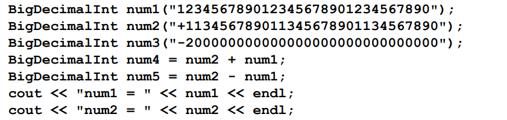

# Big Decimal Integer

## Description:

### In this Repo it is required to develop a new C++ type (class) that can hold unlimited decimal integer values and performs arithmetic operations on them. You will develop in C++ a class, BigDecimalInt that supports writingstatements with very long integer values.

### Like this:

### Design the class BigDecimalInt that has the following public interface (set of operations available to use by developers using the class):

a.BigDecimalInt (string decStr); // Initializes fromstring & rejects bad input 
b.BigDecimalInt (int decInt); // Initialize from integer 
c.BigDecimalInt operator+ (BigDecimalInt anotherDec); 
d.BigDecimalInt operator- (BigDecimalInt anotherDec); 
e.bool operator< (BigDecimalInt anotherDec); 
f.bool operator> (BigDecimalInt anotherDec); 
g.bool operator==(BigDecimalInt anotherDec); 
h.BigDecimalInt operator= (BigDecimalInt anotherDec); 
i.int size(); 
j.int sign(); 
